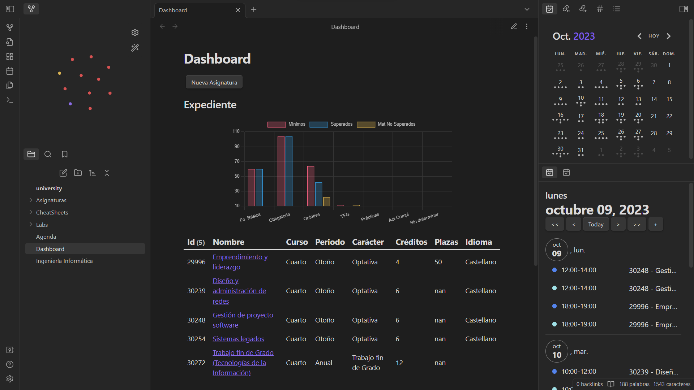

# Obsidian template generator



## Instalación 🔧

### Pre-requisitos 📋

1. **Obsidian**: Se requiere tener Obsidian instalado en su sistema. Puede descargar Obsidian desde su [sitio web oficial](https://obsidian.md/download).

2. **Python**: Se requiere tener Python instalado en su sistema. Puede descargar la última versión de Python desde el [sitio web oficial](https://www.python.org/downloads/) de Python.

--- 

> **Note** 
> Estos pasos a seguir son los mismos para cada una de las ramas / vaults que puedes encontrar en este repositorio. Lo que puede variar son las variables de entorno situadas en: `src/.env`

### Paso 1

Clona el repositorio en tu dispositivo.

```bash
git clone -b <desired_branch> https://github.com/hec7orci7o/obsidian-template-generator.git
```

### Paso 2

Una vez clonado abre el fichero `.env.example` situado en la carpeta `src` y rellena las variables de entorno con sus correspondientes valores. Por último, renombra el fichero `.env.example` -> `.env`.

### Paso 3

> [!NOTE]
> si no tienes instalado `virtualenv` puedes instalarlo con: `pip install virtualenv`

Crear el entorno virtual dentro de la carpeta src
```bash
cd src
virtualenv example
```
Activa el entorno virtual

En linux:
```bash
source example/bin/activate
```

En Windows:
Si windows no te deja ejecutar el script prueba a habilitar la ejecución de scripts como se menciona en este [enlace](https://www.drupaladicto.com/snippet/como-habilitar-la-ejecucion-de-scripts-para-powershell)
```bash
.\example\Scripts\activate
```

Instala las dependencias dentro del entorno
```bash
pip install -r requirements.txt
```

### Paso 4

Abre la carpeta vault con obsidian y salvo que se indique algo más en los `README.md` de cada vault / rama ya habrás acabado con la instalación.

> [!NOTE] 
> La gente de Windows debe acceder dentro de obsidian y modificar el comando de ejecición de los scripts al igual que en el [paso 3](#paso-3).

El vault se creó utilizando Linux por lo que deberás cambiar el comando en caso de que uses Windows.
